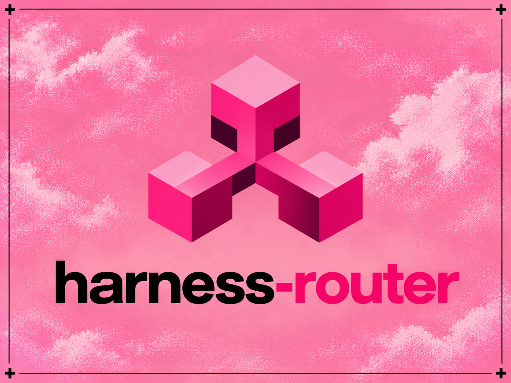

# Harness Router

<p align="center">
  
</p>

<p align="center">
  <strong>A decision layer embedded into the harness tool-selection loop.</strong>
</p>

<p align="center">
  Harness Router intercepts a harness at its available decision boundary,
  selects the next tool with cache, Jev, and optional MCTS,
  and returns control to the host harness for execution.
</p>

<p align="center">
  <a href="https://harness-router.vercel.app/">Website</a>
  ·
  <a href="#how-it-works">How it works</a>
  ·
  <a href="#integrations">Integrations</a>
  ·
  <a href="#mcp">MCP</a>
  ·
  <a href="#python-api">Python API</a>
</p>

---

## What Harness Router does

Agent harnesses already run a loop:

```text
goal
  │
  ▼
reason
  │
  ▼
choose a tool
  │
  ▼
execute
  │
  ▼
observe result
  │
  └──────────────► next turn
```

Harness Router adds a dedicated decision layer around the **tool-selection step**:

```text
                 harness
                    │
                    ▼
              decision point
                    │
                    ▼
          ┌────────────────────┐
          │   Harness Router   │
          │                    │
          │ cache → Jev → MCTS │
          └─────────┬──────────┘
                    │
              selected tool
                    │
                    ▼
                 harness
                    │
             args / policy /
          permissions / execution
                    │
                    ▼
                 result
                    │
                    └──────────► next decision
```

The harness remains responsible for the rest of the agent.

Harness Router focuses on **which available tool should be used next**.

It does not replace:

- reasoning,
- user-intent handling,
- argument generation,
- permissions,
- approvals,
- credentials,
- sandboxing,
- tool execution,
- result processing.

---

# How it works

A routing request follows the cheapest applicable path:

```text
                 routing request
                       │
                       ▼
                ┌─────────────┐
                │    Cache    │
                └──────┬──────┘
                       │ miss
                       ▼
                ┌─────────────┐
                │     Jev     │
                │ fast choice │
                └──────┬──────┘
                       │
              ambiguous / stateful
                       │
                       ▼
                ┌─────────────┐
                │    MCTS     │
                │ bounded     │
                │ search      │
                └──────┬──────┘
                       │
                       ▼
                 routing result
```

### Cache

Previously resolved decisions can be reused without another provider call.

### Jev

Jev is the normal decision engine for choosing among available tools.

### MCTS

MCTS is an optional escalation path for cases where the best immediate action depends on possible downstream states.

MCTS operates against a simulator. It does **not** execute real tools during search.

---

# The control-flow loop

The important boundary is not the router API itself. It is where the router is inserted into the harness lifecycle.

```text
┌──────────────────────────────────────────────┐
│                    HARNESS                   │
│                                              │
│  reasoning                                   │
│      │                                       │
│      ▼                                       │
│  tool-selection point                       │
└──────┬───────────────────────────────────────┘
       │
       ▼
┌──────────────────────┐
│    Harness Router    │
│                      │
│  cache → Jev → MCTS │
└──────────┬───────────┘
           │
           ▼
     selected tool
           │
           ▼
┌──────────────────────┐
│       HARNESS         │
│                      │
│ arguments             │
│ permissions           │
│ approvals             │
│ execution             │
└──────────┬───────────┘
           │
           ▼
        result
           │
           ▼
     next agent turn
           │
           └──────────────► decision point
```

The goal is to put routing **inside the existing loop**, rather than creating a second agent beside it.

---

# Integrations

Harness Router is framework-agnostic.

Each adapter uses the strongest native control point exposed by its host. The exact degree of control therefore differs between harnesses.

## Codex

Codex integration uses:

- `SessionStart` for tool discovery,
- `PreToolUse` as the routing interception point,
- deny + re-plan when Router selects a different confident candidate.

```text
Codex
  │
  ▼
tool proposal
  │
  ▼
PreToolUse
  │
  ▼
Harness Router
  │
  ├── cache
  ├── Jev
  └── optional MCTS
  │
  ├── same / fallback / failure ──► allow
  │
  └── different confident tool ───► deny
                                      │
                                      ▼
                                   re-plan
                                      │
                                      ▼
                                  next call
```

Install:

```bash
curl -fsSL https://raw.githubusercontent.com/Protocol-Lattice/harness-router/main/scripts/install_hook.py \
  | python3 - --provider codex
```

---

## Claude Code

Claude Code uses:

- `SessionStart` for tool discovery,
- `PreToolUse` for routing,
- deny + re-plan for a confident alternative.

```text
Claude Code
    │
    ▼
tool proposal
    │
    ▼
PreToolUse
    │
    ▼
Harness Router
    │
    ├── cache → Jev → optional MCTS
    │
    ├── same / fallback ──────► normal flow
    │
    └── different tool ───────► deny + re-plan
                                  │
                                  ▼
                              next call
```

The hook does not execute tools or rewrite their arguments.

See [Claude integration](.claude/README.md).

Install:

```bash
curl -fsSL https://raw.githubusercontent.com/Protocol-Lattice/harness-router/main/scripts/install_hook.py \
  | python3 - --provider claude
```

---

## ohmypi

ohmypi exposes an active-tool control point.

The integration can select the active tool set before the next provider request:

```text
agent turn
    │
    ▼
before_agent_start
    │
    ▼
Harness Router
    │
    ├── cache
    ├── Jev
    └── optional MCTS
    │
    ▼
setActiveTools([selected])
    │
    ▼
next provider request
    │
    ▼
tool execution
    │
    ▼
next routing decision
```

The active tool set is restored on fallback, timeout, malformed output, low confidence, or router failure.

See [ohmypi integration](.omp/README.md).

Install:

```bash
curl -fsSL https://raw.githubusercontent.com/Protocol-Lattice/harness-router/main/scripts/install_hook.py \
  | python3 - --provider ohmypi
```

---

## Antigravity

Antigravity uses its native `PreToolUse` hook.

```text
Antigravity
    │
    ▼
tool proposal
    │
    ▼
PreToolUse
    │
    ▼
live tool inventory
    │
    ▼
Harness Router
    │
    ├── cache → Jev → optional MCTS
    │
    ├── same / fallback ──────► allow
    │
    └── different tool ───────► deny + re-plan
```

The adapter uses the live conversation tool inventory and does not invent a fallback catalog when discovery fails.

See [Antigravity integration](.antigravity/README.md).

Install:

```bash
curl -fsSL https://raw.githubusercontent.com/Protocol-Lattice/harness-router/main/scripts/install_hook.py \
  | python3 - --provider antigravity
```

---

## DeepSeek Harness

DeepSeek Harness can reach Router through its supported Codex hook bridge.

```text
DeepSeek Harness
    │
    ▼
tools/pre-execute
    │
    ▼
Codex hook bridge
    │
    ▼
Harness Router
    │
    ├── same / fallback / failure ──► allow
    │
    └── different tool ─────────────► deny + re-plan
```

This integration uses a supplied catalog when a faithful live tool registry is unavailable and fails open when valid routing context cannot be established.

Install:

```bash
python3 hooks/deepseek/install.py
dsh --patch .dsh/harness-router.patch.yml
```

See [DeepSeek integration](hooks/deepseek/README.md).

---

# MCP

Harness Router is also available as an MCP server:

```bash
harness-router-mcp
```

Available tools:

| Tool | Purpose |
| --- | --- |
| `route` | Fast next-tool routing |
| `route_mcts` | Bounded multi-step routing |

Example:

```toml
[mcp_servers.harness-router]
command = "harness-router-mcp"
```

MCP provides an explicit routing interface for hosts that do not expose a suitable automatic hook.

---

# Installation

Requires **Python 3.11+**.

```bash
uv tool install --force --with 'mcp>=2,<3' \
  'git+https://github.com/Protocol-Lattice/harness-router.git@main'
```

Set your OpenRouter key:

```bash
export OPENROUTER_API_KEY="your-key"
```

Default decision model:

```text
typesafe/jev-1.13
```

---

# CLI

Route a tool-selection decision directly:

```bash
har route \
  --goal "Fix the failing parser test" \
  --observation "Failure points to src/parser.py" \
  --tools-json '[
    {
      "name": "read_file",
      "description": "Read a repository file",
      "category": "inspect",
      "risk": "low"
    },
    {
      "name": "search_code",
      "description": "Search repository source",
      "category": "inspect",
      "risk": "low"
    },
    {
      "name": "run_tests",
      "description": "Run tests",
      "category": "verify",
      "risk": "low"
    }
  ]'
```

Example result:

```json
{
  "tool": "read_file",
  "confidence": 0.93,
  "fallback": false
}
```

---

# Python API

```python
import asyncio

from harness_router import (
    HarnessState,
    JevToolRouter,
    OpenRouterConfig,
    OpenRouterJevProvider,
    RiskLevel,
    RoutingConfig,
    ToolDescriptor,
)


async def main():
    provider = OpenRouterJevProvider.from_config(OpenRouterConfig())
    router = JevToolRouter(provider, RoutingConfig())

    tools = [
        ToolDescriptor(
            name="read_file",
            description="Read a repository file",
            category="inspect",
            risk=RiskLevel.LOW,
        ),
        ToolDescriptor(
            name="search_code",
            description="Search repository source",
            category="inspect",
            risk=RiskLevel.LOW,
        ),
    ]

    try:
        decision = await router.route(
            HarnessState(
                goal="Fix the failing parser test",
                observation="Failure points to src/parser.py",
            ),
            tools,
        )

        print(decision.tool)
        print(decision.confidence)
    finally:
        await provider.aclose()


asyncio.run(main())
```

---

# MCTS

Use `route_mcts` when the immediate choice depends on possible downstream outcomes.

```text
current state
     │
     ▼
policy prior
     │
     ▼
local simulator
     │
     ├── state
     ├── candidate tools
     ├── transition
     ├── reward
     └── terminal condition
     │
     ▼
best first action
```

Example:

```python
mcts = MCTSToolRouter(
    simulator,
    policy_router=router,
    config=MCTSConfig(
        simulations=64,
        max_depth=4,
        max_policy_evaluations=1,
    ),
)
```

The simulator should model possible transitions. It should not execute real tools.

---

# What Router decides

Harness Router is designed for **known alternatives at a tool-selection point**.

Examples:

- `read_file` vs `search_code`,
- one MCP tool vs another,
- inspect vs mutate,
- test vs inspect,
- one browser action vs another,
- which available action best advances the current state.

Keep these in the main planner:

- user-intent interpretation,
- code generation,
- patch generation,
- complex command construction,
- long-form argument generation,
- open-ended planning,
- authorization.

The intended division is:

```text
                 harness / planner
                       │
                  goal + state
                       │
                       ▼
                Harness Router
                       │
                   next tool
                       │
                       ▼
                argument generation
                       │
                       ▼
                   permissions
                       │
                       ▼
                    execution
                       │
                       ▼
                     result
                       │
                       └────────► next iteration
```

---

# Large tool registries

Routing becomes more useful when many tools overlap semantically.

A registry can be narrowed hierarchically:

```text
                 current state
                      │
                      ▼
                 category route
                      │
        ┌─────────────┼─────────────┐
        ▼             ▼             ▼
     inspect        mutate        verify
        │             │             │
   read/search    write/patch    test/lint
```

Typical categories include:

`inspect` · `mutate` · `execute` · `verify` · `git` · `browser` · `memory` · `network` · `finish`

---

# Failure and safety model

Harness Router is a **decision layer**, not an authorization layer.

A high-confidence result means:

> This is the strongest candidate from the supplied tool set.

It does not mean:

> This action is authorized.

The host harness remains responsible for:

- permissions,
- approvals,
- sandboxing,
- credentials,
- execution,
- user confirmation.

Router does not bypass those controls.

Where an integration supports it, failures fail open. If discovery, routing, or the decision provider is unavailable, the host can continue with its normal behavior.

---

# Skill mode

For agents without automatic hook integration, use:

```text
skills/harness-router/SKILL.md
```

The explicit skill path is:

```text
agent
  │
  ▼
routing skill
  │
  ▼
Harness Router
  │
  ▼
next tool
```

Use **hooks** when routing should be embedded into the host lifecycle.

Use the **skill** when routing should be invoked explicitly.

Use **MCP** when the host already supports MCP and you want an explicit routing tool.

---

# When to use it

Harness Router is most useful when:

- several tools can plausibly satisfy the same step,
- the tool registry is large,
- wrong-tool selection causes retries,
- tool calls are expensive,
- the host exposes a useful control point,
- a dedicated decision layer can reduce work done by the main model.

If the correct tool is obvious and the registry is small, routing may add unnecessary overhead.

Measure the whole loop:

- task success,
- tool-selection accuracy,
- wrong-tool rate,
- retries,
- latency,
- token usage,
- provider cost.

Router latency alone is not the objective.

---

# Development

```bash
git clone https://github.com/Protocol-Lattice/harness-router.git
cd harness-router
python -m pip install -e ".[dev]"
```

Run checks:

```bash
pytest
ruff check .
mypy
```

---

# Project status

Harness Router is **alpha**.

The project focuses on one boundary:

```text
current harness state
        │
        ▼
  tool-selection point
        │
        ▼
  Harness Router
        │
        ▼
     next tool
```

The host harness remains in control of the rest of the agent lifecycle.

---

<p align="center">
  <strong>A decision layer embedded into the harness tool-selection loop.</strong>
  <br>
  Cache → Jev → MCTS
</p>

<p align="center">
  <a href="https://harness-router.vercel.app/">harness-router.vercel.app</a>
</p>

## License

MIT.
